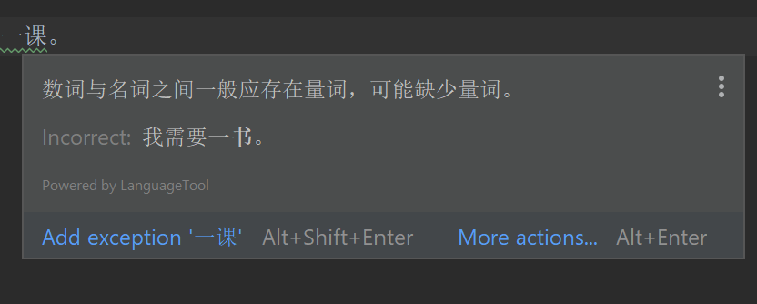

# AlvaJvm

项目名是`AlvaJvm`。因为是Java项目，所以用了驼峰命名法。

自己实现的jvm，部分弥补一下大一下学期没有好好做软工大作业的遗憾。

我可能错过了一个亿...所以现在让我追回来一亿五千万吧。

会记录一下项目周期和完成情况。

## doc

- [命令行输入](etc/doc/cli.md)

## 项目进度跟踪

- 2021.01.09 创建项目
- 2021.01.09 命令行输入部分基本完成

## 灌水

当时还年轻~~mindless~~，不知道珍惜软院为数不多的好课（好助教），然后大二上的软院给我好好上了一课。

现在在回去看助教们写的文档，用感动来形容我的心情绝对不为过。

就说文档中的后续课程安利吧，推荐了包括jyy的ics、os，赵建华的算法设计与分析等。

其中，ics和算法是我大二上非常非常后悔没有上的两门课，为了弥补这一点需要在大二寒假自学ics和算法导论。

os是我大二下准备跨专业选修的一门课，即使要免修不免考院内核心课我也一定要上。

大一下但凡认真一点，有大二上或者大一上一半认真，我都不至于现在在这里后悔。

大二上也不怎么认真其实...当然比大一下要好，但是比不了大一上。大一上的我甚至连B站都不看，现在想来完全不理解那个时候的生存方式是什么。

当然后悔是没用的，只能尽力弥补了。

加油吧。写在这里也是勉励自己，千万别三分钟热度。

## 彩蛋

不仅`大二上的软院给我好好上了一课`，idea也给我好好上了一课啊。

